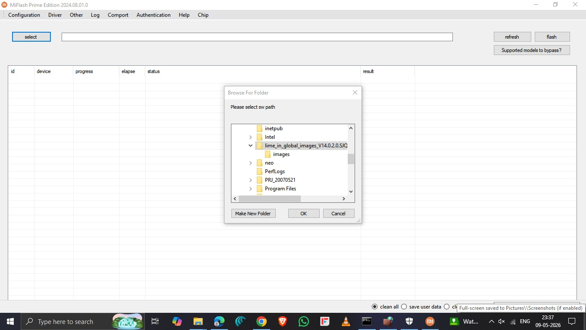
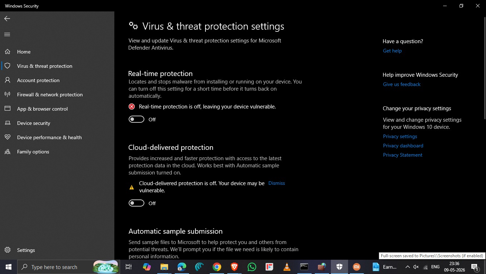

# 🔧 Unbrick Your Phone (Redmi 9t Tested ✅)— Hard Brick Solution

> Recover your **hard-bricked Redmi 9T** (or other supported Xiaomi/POCO devices) using **Prime Mi Flash Tool** via EDL (9008) mode.

---

## ⚠️ Disclaimer

> **Use this tool entirely at your own risk.**
> Flashing your device may void your warranty and could cause permanent damage if done incorrectly.
> For better safety and privacy, it is **strongly recommended** to use Prime Mi Flash Tool on a **secondary PC**, **virtual machine**, or isolated **testing environment**.
> The author is not responsible for any damage, data loss, or issues arising from use of this guide.

---

## 📸 Screenshots

| Prime Mi Flash Tool | Windows Security Settings |
|---|---|
|  |  |

---

## 🛡️ Windows Security — Important Notice

Before using Prime Mi Flash Tool, **Windows Defender / Microsoft Security** may automatically **delete or quarantine** the tool because it contains low-level device flashing components.

You must **temporarily disable** the following settings:

- 🔴 **Real-time protection**
- 🔴 **Cloud-delivered protection**
- 🔴 **Automatic sample submission**

> ⚠️ **Re-enable all security settings immediately after flashing is complete.**

### How to disable (Windows 10/11):
1. Open **Windows Security** → **Virus & threat protection**
2. Click **Manage settings** under *Virus & threat protection settings*
3. Toggle **OFF**: Real-time protection, Cloud-delivered protection, Automatic sample submission
4. Proceed with flashing
5. Toggle everything back **ON** after you're done

---

## 📥 Download Files

| File | Link |
|---|---|
| Prime Mi Flash Tool + Firehose Files | [Download via Telegram](https://t.me/joes_stuff/109832?single) |

---

## 📋 Recovery Guide

### 1. Install Prime Mi Flash Tool
Download and install the modified Prime Mi Flash Tool from the link above.

### 2. Download Correct ROM
Download the correct **Fastboot ROM** for your Redmi 9T variant:

| Region | Notes |
|---|---|
| Global | For global market devices |
| India (IN) | For India variant |
| EEA | For European Economic Area |

> Make sure the ROM region matches your device's variant. Using the wrong region ROM can cause issues.

### 3. Replace Firehose File
1. Open the extracted ROM folder → navigate to `images/`
2. Locate the file: `prog_firehose_ddr.elf`
3. **Replace it** with the patched firehose loader included in the Prime Mi Flash Tool download

> ⚠️ **Keep the filename exactly as:** `prog_firehose_ddr.elf` — do not rename it.

### 4. Connect Device in EDL Mode
Your device must be in **EDL (Emergency Download) Mode**.

It should appear in **Device Manager** as:
```
Qualcomm HS-USB QDLoader 9008
```

> If it doesn't appear, install the Qualcomm EDL driver (included in Prime Mi Flash Tool package).

### 5. Flash the ROM
1. Open **Prime Mi Flash Tool** as **Administrator**
2. Click **Select** and browse to your ROM folder
3. Click **Refresh** / **Detect Device** — confirm `COM` port appears
4. Choose flash mode: `Clean All` (full wipe) or `Save User Data` as needed
5. Click **Flash** and wait for the process to complete

> ✅ Do **not** disconnect the device during flashing.

### 6. After Flashing
- **Charge the device immediately** after recovery (at least 10–15 minutes before booting)
- Avoid repeatedly pressing the power button on very low battery
- First boot may take **3–5 minutes** — this is normal

---

## 💡 Important Tips

- ✅ Use a **high-quality, data-capable USB cable** (not a charge-only cable)
- ✅ Plug directly into **rear motherboard USB ports** on your PC
- ❌ Avoid **USB hubs** or front-panel ports
- ✅ Keep firehose filename **unchanged** (`prog_firehose_ddr.elf`)
- ✅ Use the **correct ROM region** matching your device variant
- ✅ Ensure **stable USB connection** throughout the flashing process
- ✅ Disable antivirus **before** extracting and running the tool

---

## 📱 Supported Devices

Prime Mi Flash Tool supports a wide range of Xiaomi, Redmi, POCO, and Mi devices.

👉 **[View Full Supported Devices List](supported-devices.html)**

Some confirmed supported devices include:

| Series | Devices |
|---|---|
| Redmi 9 Series | Redmi 9T, Redmi 9 Power, Redmi 9A, Redmi 9C |
| POCO | POCO M2 Pro, POCO X3 NFC, POCO X3 Pro, POCO M3 |
| Redmi Note Series | Redmi Note 9, Note 9 Pro, Note 9S, Note 10 Series |
| Mi Series | Mi 10T, Mi 10T Pro, Mi 10T Lite |
| Black Shark Series | Black Shark 3, Black Shark 3 Pro |

> Refer to the screenshot above or the [supported devices page](supported-devices.html) for the complete list.

---

## 🆘 Support

Stuck? Reach out:

- 💬 **Telegram:** [@om_n_15](https://t.me/om_n_15)

---

## 🙏 Credits

- **Prime Mi Flash Tool** — Original developers
- **Joe's Stuff** — Telegram channel hosting files ([t.me/joes_stuff](https://t.me/joes_stuff))
- **Xiaomi / Qualcomm Community** — EDL mode research & firehose loaders
- Community contributors who tested and documented the process

---

> ⭐ If this guide helped you, consider starring the repository!
